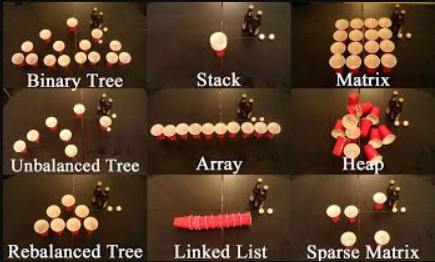

# CSE-203 Data-Structure

### **Course teacher**

- [**Dr. Md. Abul Kashem Mia**](https://cse.buet.ac.bd/faculty/facdetail.php?id=kashem)
- [**Dr. Mohammed Eunus Ali(MEA)**](https://cse.buet.ac.bd/faculty/facdetail.php?id=eunus)

### **Reference book**

- Introduction to Algorithms | [3rd edition](http://libgen.gs/ads.php?md5=ED372AB968C3D988E0490962553AA3CF) | [3rd edition solution](http://libgen.gs/ads.php?md5=ABAA82D924873411F9169CB260A880C6)

## Past questions

| [17-18](http://lib.buet.ac.bd:8080/xmlui/bitstream/handle/123456789/5094/CSE%20L-2%2cT-1%282017-2018%29%20%281%29.pdf?sequence=1&isAllowed=y) | [16-17](http://lib.buet.ac.bd:8080/xmlui/bitstream/handle/123456789/4710/CSE%20L-2%2cT-1%20%282016-2017%29.pdf?sequence=1&isAllowed=y) | 

### Week by Week progression(dd/mm/yyyy)

- Week-1 (MEA)
  - Class - 1 - 28-02-2021 : Introduction to Data structure and algorithm | [SLIDE](https://drive.google.com/drive/folders/1TvfHJ0dDtURbmSXAEXgnaylD5YWiyWr8) | 
  - Class - 2 - 01-03-2021 : Asymptotic analysis | [SLIDE](https://drive.google.com/drive/folders/1TvfHJ0dDtURbmSXAEXgnaylD5YWiyWr8) | 
  - Class - 3 - 03 -03-2021: Asymptotic analysis-2 | [SLIDE](https://drive.google.com/drive/folders/1TvfHJ0dDtURbmSXAEXgnaylD5YWiyWr8) |

- Week-2 (MEA)
  - Class- 4 - 07-03-2021 : Abstract Data Type | [SLIDE](https://drive.google.com/drive/folders/1TvfHJ0dDtURbmSXAEXgnaylD5YWiyWr8) | 
  - Class- 5 - 08-03-2021 : Array and linked list | [SLIDE](https://drive.google.com/drive/folders/1TvfHJ0dDtURbmSXAEXgnaylD5YWiyWr8) | 
  - Class- 6 - 10-03-2021 : Linked list operations  | [SLIDE](https://drive.google.com/drive/folders/1TvfHJ0dDtURbmSXAEXgnaylD5YWiyWr8) |
- Week-3 (MEA)
  - Class- 7 - 14-03-2021 : Doubly linked list and stack | [SLIDE](https://drive.google.com/drive/folders/1TvfHJ0dDtURbmSXAEXgnaylD5YWiyWr8) |
  - Class - 8 - 15-03-2021 : Stack implementation and queue | [SLIDE](https://drive.google.com/drive/folders/1TvfHJ0dDtURbmSXAEXgnaylD5YWiyWr8) |
- Week-4 (MEA)
  - Class- 9 - 21-03-2021: Stack and queue | [SLIDE](https://drive.google.com/drive/folders/1TvfHJ0dDtURbmSXAEXgnaylD5YWiyWr8) |
  - Class - 11 - 22-03-2021 : Tree(terminology) | [SLIDE](https://drive.google.com/drive/folders/1TvfHJ0dDtURbmSXAEXgnaylD5YWiyWr8) |
  - Class - 12 - 24-03-2021: Tree methods | SLIDE |
- Week - 5 (MEA)
  - Class -13 - 28-03-2021 : BST methods | SLIDE |