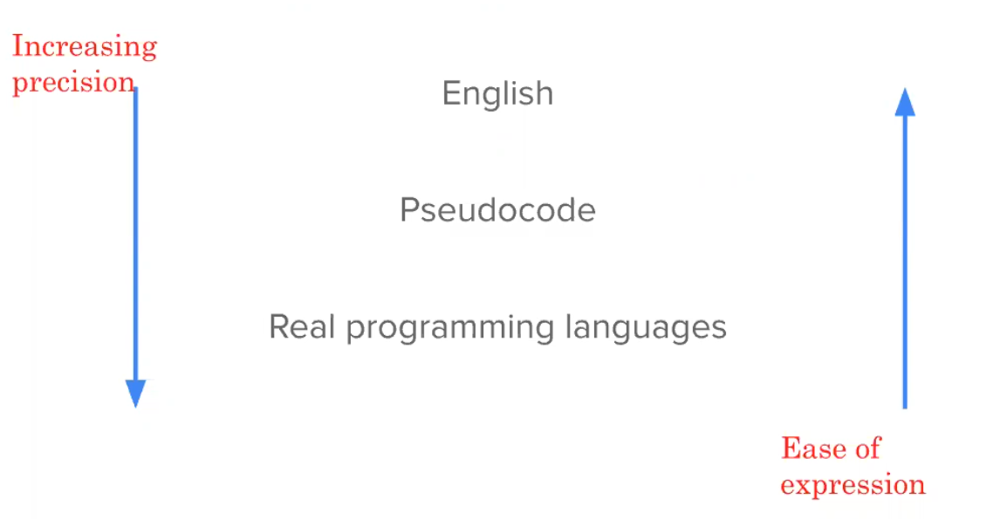
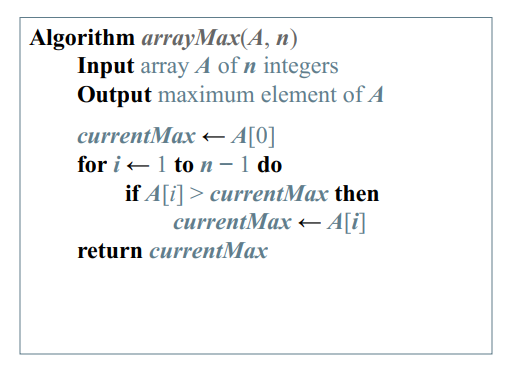

# Lecture-1: Introduction
###  Acknowledgement: Dr. Mohammed Eunus Ali,Professor, CSE, BUET

### Date: 28-02-2021
### Documented by : Hasan Masum, CSE-18, BUET
---

## Table of Content

- [Why Data Structure(DS) and Algorithm(algo)?](#why-data-structure-ds--and-algorithm-algo--)
- [What will we study?](#what-will-we-study-)
- [Data Structures & Algorithm](#data-structures---algorithm)
- [How to express algorithms?](#how-to-express-algorithms-)
- [Pseudocode](#pseudocode)
  * [Control flow](#control-flow)
  * [Method declaration](#method-declaration)
  * [Method call](#method-call)
  * [Return value](#return-value)
  * [Expressions](#expressions)
  * [Example](#example)
- [Correctness](#correctness)

## Why Data Structure(DS) and Algorithm(algo)?

We can solve a lot of problem effciently using DS and Algo. For example for finding shortest path between two cities we need to store roads and junctions information and represent them as a graph using DS and finally we need to use a graph alogrithm to find the shortest path. DS and Algo is also useful in sovling many other problem like detecting fake news or detecting objects in an image.

## What will we study?

- **Data structures for efficiently storing, accessing,**
**and modifying data**
    -  Stacks, Queues, etc.
    -  Trees, Graphs, etc.
- **Expressing algorithms**
    -  Define a problem precisely and abstractly
    -  Presenting algorithms using pseudocode
- **Algorithm analysis**
    -  Time and space complexity
    -  What problems are so hard that efficient algorithms are
unlikely to exist
- **Designing algorithms**
    -  Algorithms for classical problems
    -  Meta algorithms (classes of algorithms) and when you
should use which

## Data Structures & Algorithm

- **Data Structure**: A way of organinzing, storing, accessing and updating data. Oranizing and storing means how we want to store data, and accessing and upading(including ) are operations on stored data. 
Example: Arrays, Linked Lists, Stacks, Queues, Trees

- **Algorithm** :A series of precise instructions to produce a specific outcome
○ Examples: Binary Search, Merge Sort, Recursive
Backtracking
- **Program**: A program is the expression of an algorithm in a programming language. 
Example: Binary Search Tree(DS) + Tree Traversal(Algo)

## How to express algorithms?

So far we know how to design a algorithm in English and then implementation it in a real programming languages. There is a lot of information is English and all programming language are not same. So, there is an intermediate step called pseudocode which is language independent and do not have unnecessary information. In short, if we write a algorithm without thinking about any specific language if called pseudocode.

</img>

## Pseudocode
Pseudocde is a high leve description of an algorithm and less detailed than a program. It also hides program design issues.

- ### Control flow

    if … then … [else …]

    - while … do …
    - repeat … until …
    - for … do …
    - Indentation replaces braces
- ### Method declaration
    - Algorithm method (arg [, arg…])
    - Input …
    - Output …
- ### Method call
    - var.method (arg [, arg…])
- ### Return value
    - return expression
- ### Expressions
    - ← Assignment(like = in Java)
    - Equality testing(like == in Java)
    

n2 Superscripts and other
mathematical formatting
allowed

### Example

</img>

## Correctness

- How do you know an algorithm is correct?
    - For every input instance, it halts with the correct output
    - Since there are usually infinitely many inputs, it is not
trivial
- Incorrect algorithms
    - Might not halt at all on some input instances
    - Might halt with other than the desired answer

