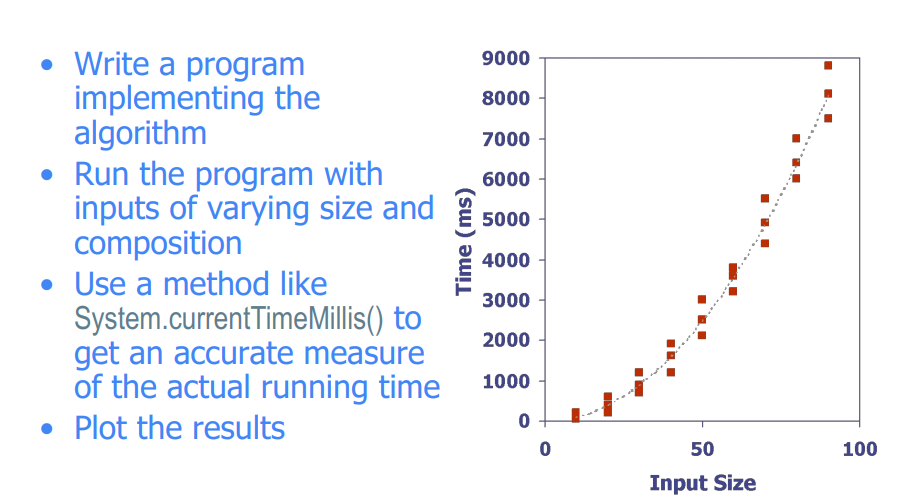
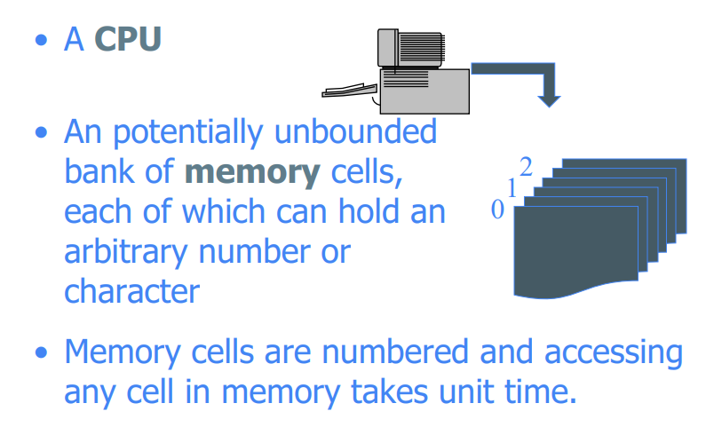
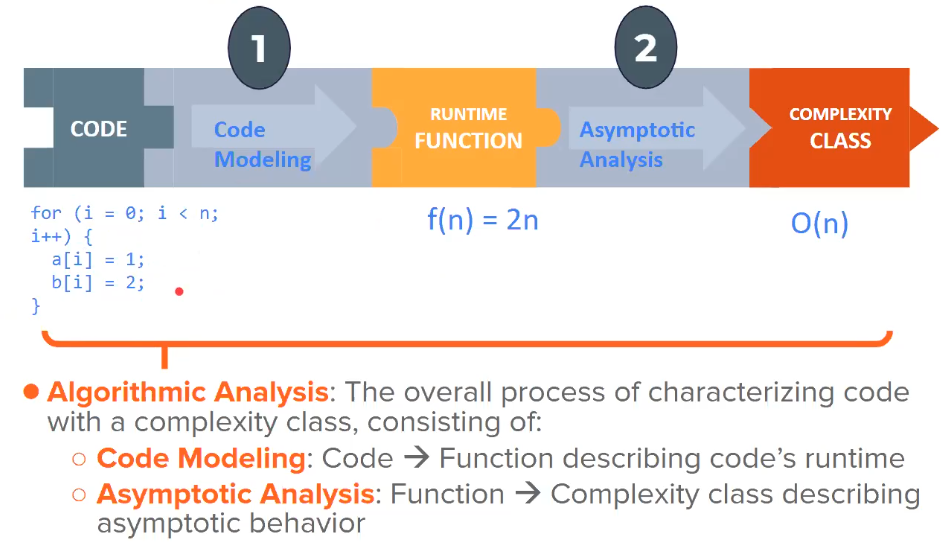
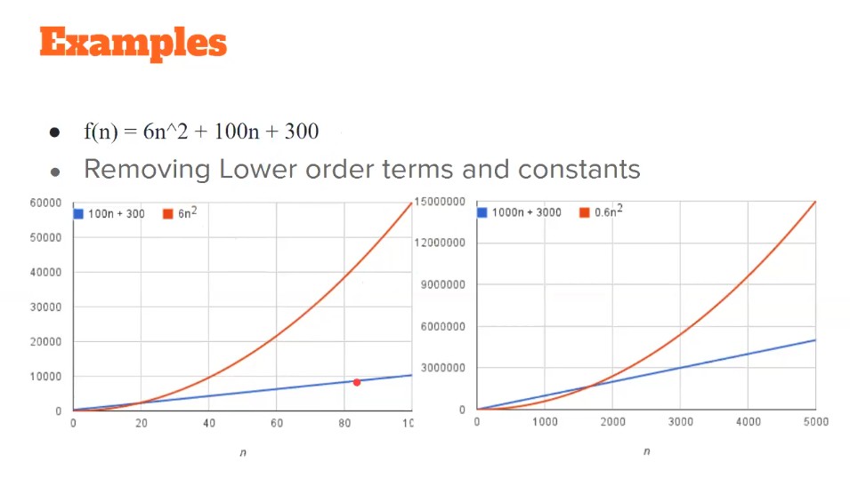
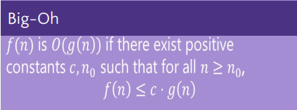
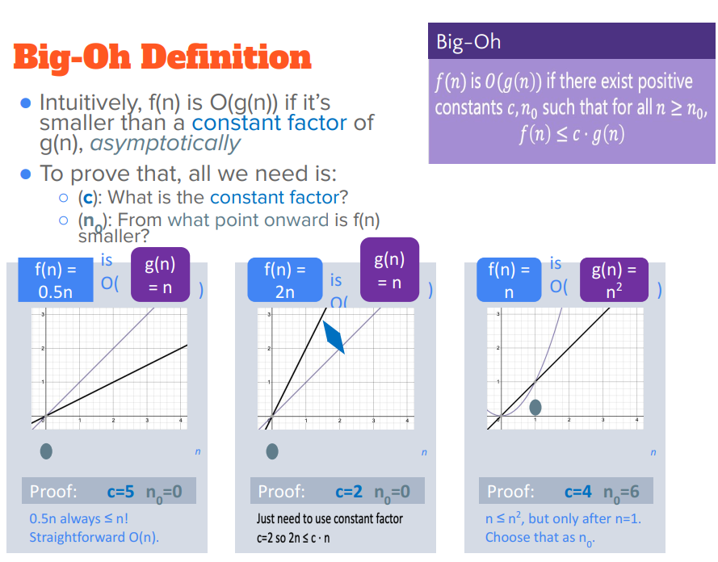
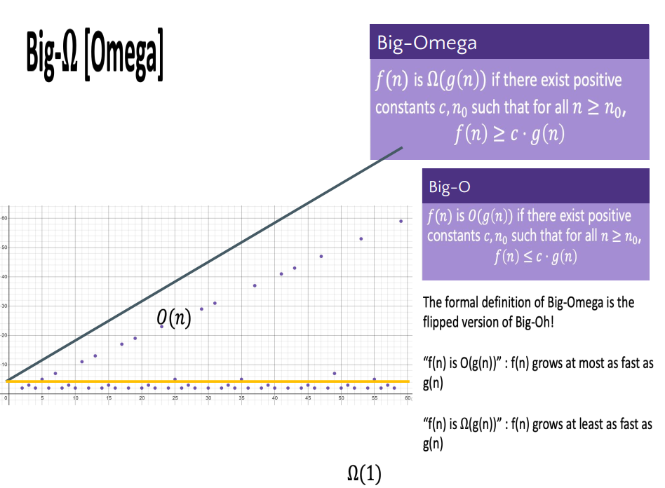
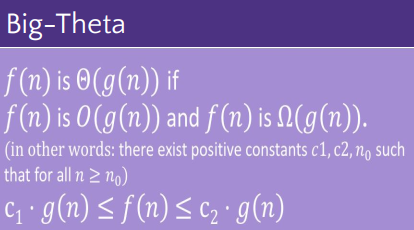
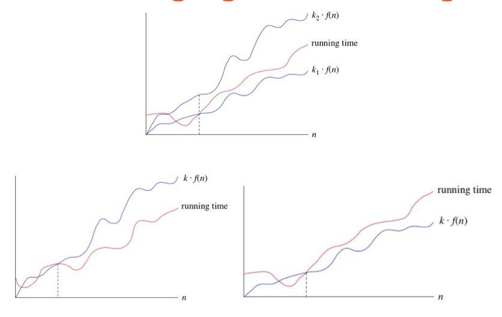
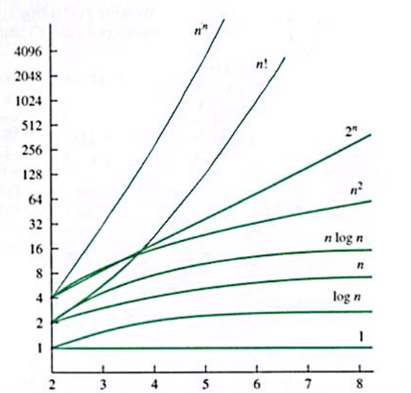

#  Lecture-2: Asymptotic Analysis of Algorithms

### Acknowledgement : Dr. Mohammed Eunus Ali,Professor, CSE, BUET

### Date: 01-02-2021 - Monday

### Documented by : [Hasan Masum, CSE-18, BUET](https://hmasum18.github.io/)

---

## Table of Content

- [Runtime](#runtime)
- [Experimental Studies](#experimental-studies)
- [Limitations of Experiments](#limitations-of-experiments)
- [Theoretical Analysis](#theoretical-analysis)
- [The Random Access Memory Model](#the-random-access-memory-model)
- [Primitive Operations](#primitive-operations)
- [Counting Primitive Operations(code modeling)](#counting-primitive-operations-code-modeling-)
- [Estimating Running Time](#estimating-running-time)
- [Growth Rate of Running Time](#growth-rate-of-running-time)
- [Algorithmic Analysis Roadmap](#algorithmic-analysis-roadmap)
- [Asymptotic Analysis](#asymptotic-analysis)
  - [Example](#example)
- [Asymptotic Notations: Big Oh, Omega, and Theta](#asymptotic-notations--big-oh--omega--and-theta)
  * [Example](#example-1)

Asymptotic analysis of Algorithms means theoretically analyze for a large input dataset what will be the performance of the algorithm.

## Runtime

Runtime of an algorithm depends on input dataset size and running time typically grows with the input size. Usually we care about best case, worst case and average case runtime of an algorithm. But average case is often difficult to determine. So we often focus on the worst case running time as it is easier to analyze.

Runtime also depends on the hardware the program is runnning.

## Experimental Studies




## Limitations of Experiments

- It is necessary to implement the algorithm,
which may be difficult
- Results may not be indicative of the
running time on other inputs not included
in the experiment.
- In order to compare two algorithms, the
same hardware and software environments
must be used

## Theoretical Analysis

If we want to analyze a algo theoretically we need to model the algo like the following - 

- Uses a high-level description of the algorithm instead of an implementation
- Characterizes running time as a function of the input size, n.
- Takes into account all possible inputs
- Allows us to evaluate the speed of an algorithm independent of the hardware/software environment

## The Random Access Memory Model

When a instruction is given to the computer the CPU access an element(memory cell that can hold a number or character) from ram and do some operations. So the operations here is accessing elements from memory and operations done by CPU.




## Primitive Operations

It is assumed that each basic operations takes constant amount of time in the RAM model while analyzing algorithm.
Examples: 

- Evaluating an expression
- Assigning a value to a variable
- Indexing into an array
- Calling a method
- Returning from a method
If we can count the total number of these basic operations/instructions then we can estimate the complexity of the algo

## Counting Primitive Operations(code modeling)

By inspecting the pseudocode, we can determine the maximum number of primitive operations executed by an algorithm, as a function of the input size. 

```pseudocode
/*used model: here we considered array index, assigning and returing individual operations*/
Algorithm arrayMax (A, n) 				# operations    
	currentMax ← A[0]				2 or 1
	for i ← 1 to n − 1 do				2n or n
		if A[i] > currentMax then		2(n − 1) or  n-1
			currentMax ← A[i]		2(n − 1) or  n-1
		{ increment counter i }			2(n − 1) or  n-1
	return currentMax				1	or	1
							Total 8n − 2[model-1] or 4n-1[model-2]
```

## Estimating Running Time

Runtime time is machine dependent. Algorithm arrayMax executes 8n − 2 primitive operations in the worst case. Define:
<p style="text-align:center">a = Time taken by the fastest primitive operation</p>
<p style="text-align:center">b = Time taken by the slowest primitive operation</p>
Let T(n) be worst-case time of arrayMax. Then
<p style="text-align:center">a * (8n − 2) ≤ T(n) ≤ b * (8n − 2)</p>
Hence, the running time T(n) is bounded by two linear functions
<br>
<br>

## Growth Rate of Running Time

Running time of an algorithm depends on hardware and software it is running. The linear growth rate of the running time T(n) is an intrinsic property of our algorithm arrayMax. So Changing the hardware/software environment affects T(n) by a constant factor, but does not alter the growth rate of T(n). 

## Algorithmic Analysis Roadmap

First we have to write the code or pseudocode of an algorithm. Then we have to model the code for calculating total number of operations. After that we define a runtime function as function of input size n. Finally, we have to determine complexity class of the function - linear, polynomial or exponential, etc.  

For example in the following picture our the for loop runs n times and let assume there is 2 operation inside(though there is more). So runtime function, f(n) = 2n which is a linear function of n and the complexity class of the function is O(n).



## Asymptotic Analysis

Key points of asymptotic Analysis are - 

- First, we need to **determine how long the algorithm takes** ,in terms of the size of its input.
○ the running me of the algorithm as a function of the
size of its input.
- The second idea is that we must focus on **how fast a function grows with the input size**.(will ignore the constant i.e. consider 8n-2 as n)
  -  We call this the rate of growth of the running me.(n n^2 or log(n) etc.)
- By **dropping the less significant terms and the constant coefficients**, we can focus on the important part of an algorithm's running time --its rate of growth—without getting mired in details that complicate our understanding. For example, if T(n) = 8*n-2 from the model, we can write it as T(n) = n.
  - When we drop the constant coefficients and the less
significant terms

### Example

From the the graph we can see n<sup>2</sup> dominates the runtime of algo. Constant and 100n+300 has less effect on runtime when input size is much larger. So we need to model only  n<sup>2</sup> and can drop constants and 100n+300 which are less significant.



## Asymptotic Notations: Big Oh, Omega, and Theta

- Big-Oh is an upper bound: algorithm takes **at most this long** to run in worst case.






- Big-Omega is a lower bound: algorithm takes **at least this long** to run.



- Big Theta is “equal to (tight bound)" : algorithm **takes “exactly”* this long to run**.
  
    - *Except for constant factors and lower order terms
    
    - Only exists when Big-Oh == Big-Omega!





### Example

Let f(n) = 2n + 3 for an algorithm. Now 2n+3 ≤ 5n , for n>3. So for n<sub>0</sub> = 3 ,c = 5 and g(n) = n , f(n)  ∈ O(n) < O() <O().

Here O(n) is linear complexity class which is the set of all functions that have linear complexity. 

Again f(n) = 2n+3 > 1*n. So  f(n)  ∈ Ω(n) > Ω(√n) > Ω(1)

Common mathematical function which can be use as complexity class of function.

1< log n < n < n log n < n<sup>2</sup> < 2<sup>n</sup> < n!



