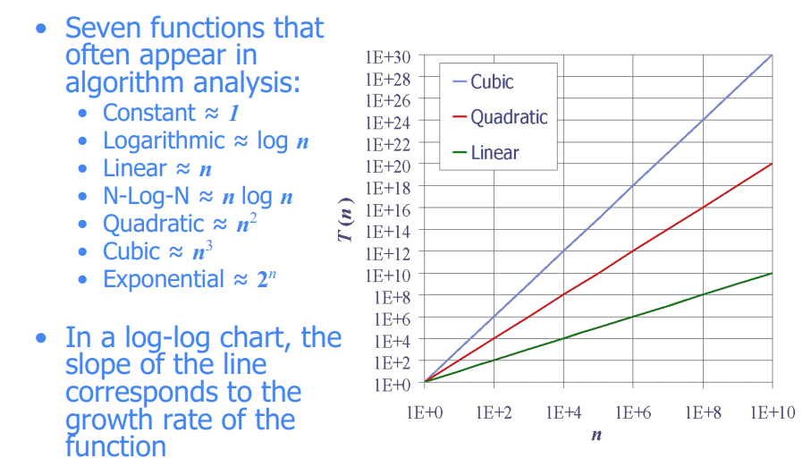

#  Lecture-3: Asymptotic Analysis of Algorithms-2

###  Acknowledgement:  Dr. Mohammed Eunus Ali,Professor, CSE, BUET

### Date: 03-02-2021 - Wednesday

### Documented by : [Hasan Masum, CSE-18, BUET](https://hmasum18.github.io/)

---

## Table of Content

- [Asymptotic Notations- Big O,  Big Ω, and Big Θ : Example](#asymptotic-notations--big-o---big----and-big-----example)
- [Seven Important Functions](#seven-important-functions)
- [Constant Factors and Lower order terms](#constant-factors-and-lower-order-terms)
- [EX- Linear Search](#ex--linear-search)
- [EX - Prime Checking](#ex---prime-checking)
- [Past Questions](#past-questions)


## Asymptotic Notations- Big O,  Big Ω, and Big Θ : Example

In last lecture we have seen Big Oh, Big Omega, and Big Theta asymptotic notations. 

_**Example:  Θ exists**_

**Let f(n) = 2n + 1 denotes the total number of operation for an algorithm.**  
Now 2n+1 <= 3*n , for n>=1 So for  n<sub>0</sub> = 1 ,c = 3,g(n) = n algorithm has **upper bound O(n)**.

Again, 2n+1 >= 1*n . So for  c = 1,g(n) = n$$ algorithm has **lower bound  Ω(n)**.

Finally, 1*n <= 2n+1 <= 3*n . So for c<sub>1</sub> = 1 , c<sub>2</sub> = 3 , g(n) = n algorithm has **tight bound Θ (n)**


_**Example:  Θ doesn't exist**_

The above example have tight bound as upper and lower bound is same. It is not obvious that all the algorithm have same g(n) for both upper bound and lower bound. So all algorithm doesn't have tight bound. Here is an example of it.

**Let f(n) = n! for an algorithm.** 

Here , n! = 1 * 2 * 3* ....*n <= n<sup>n</sup>

​	or n! <= 1*n<sup>n</sup>  . So for c=1 , g(n) = n<sup>n</sup> algorithm has  **upper bound O(n<sup>n</sup>)**

Again, n! = 1 * 2 * 3 *....*n >= 1*1*.....*1 [n times]

​	or n! >= 1*1 . So for c=1 , g(n) = 1 algorithm has  **lower bound Ω(1)** 

As g(n) is not same for both upper and lower bound. So the algorithm doesn't have any tight bound Θ.


## Seven Important Functions



## Constant Factors and Lower order terms

Lower order terms and constant factor doesn't affect the growth rate.

For example, let a function f(n) = 100 * n * log(n) + 5*n. After some value of n , nlog(n) will dominate the runtime of the algorithm.

Again log_a(n) and log_b(n)​ has the same order O(log(n)) as a&b are constants. 


## EX- Linear Search

```c++
int linearSearch(int[] arr, int toFind) {
	for (int i = 0; i <arr.length; i++) {
		if (arr[i] == toFind) {
			return i;
		}
	}
	return -1
}
```

**What’s the first step?**  
- We have code, so we need to **convert to a function describing its runtime**
- Then we know we can use asymptotic analysis to get bounds  

**Let's model the code**  
```c++
int linearSearch(int[] arr, int toFind) {
	//the loops runs n times in worst case
	//if the toFind element is at the end of the array
    // or if the toFind is not in the array
	for (int i = 0; i <arr.length; i++) {
        //2 operation - array accessing and assignment
		if (arr[i] == toFind) {                            
			return i; //one operation
		}
	}
	return -1; //one o
    peration
}
```

We can see there will be total $$2*n+1$$ operations in the worst case according to our model. So runtime function, $$f(n) = 2*n+1$$ in this case which is **O(n)**.

Again if in the best case i.e. if the element is the 1st element of the array then the there will be on only 1 operation. So linear search has **Ω(1)** at best case.

</img>

## EX - Prime Checking

```c++
boolean isPrime(int n) {
	int toTest = 2;
	while(toTest < n) {
		if (n % toTest == 0) {
			return false;
		} else {
			toTest += 1;
		}
	}
	return true;
}
```

**Step-1: Model the code**


Step-2 : Use asymptotic  analysis


## Past Questions

### 17 - 18 (16 batch)


### 16-17 (15 batch)


### 15-16(14 batch)  - 1(b) only


### (12-13)(11 batch)


### 11-12(10 batch may be)

